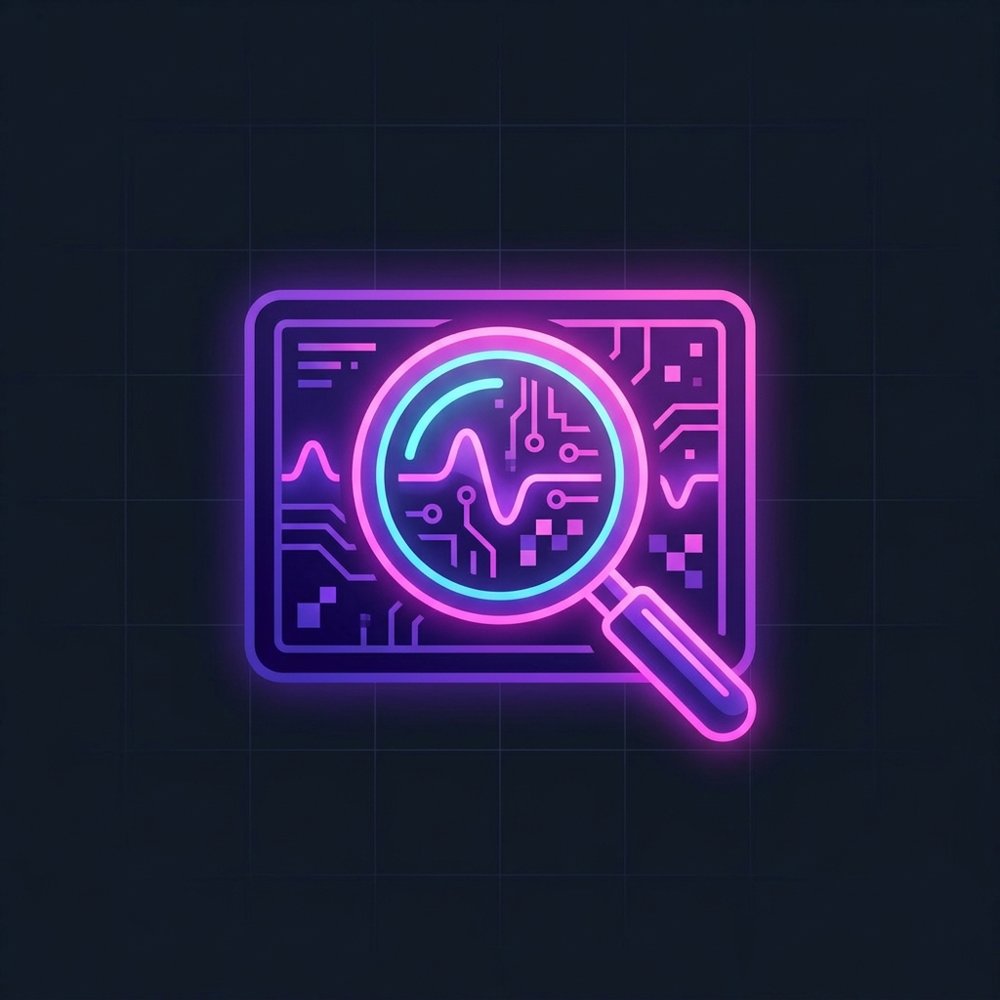

  
    

  <h1>Reverse Artist Search</h1>
  

    <strong>A dedicated, multi-engine reverse image search tool for tracking down original artists and high-resolution sources.</strong> 
    <i>A 100% full-stack application built for artists, by artists.</i>
  

  
  

    
    
    
  

  

    <a href="https://ko-fi.com/devilnine"><strong>Support this project on Ko-fi</strong></a> • <a href="https://reverse-art-search.pages.dev/"><strong>Live Demo</strong></a>
  

 

<blockquote style="border-left: 4px solid #8b5cf6; padding-left: 15px; margin-left: 0; color: #a1a1aa;">
  <strong>Note:</strong> To protect our scraping architecture and core detection algorithms from being aggressively blocked by search engines, this public repository contains the pre-compiled, obfuscated frontend application. You can still audit the network requests and deploy it yourself freely.
</blockquote>

## 🎨 What is Reverse Artist Search?

Finding the original creator of a piece of art can be incredibly difficult, especially when the image has been reposted, compressed, or cropped multiple times across social media. 

**Reverse Artist Search** solves this by concurrently querying multiple specialized search engines (like SauceNAO, IQDB, Google Lens, and Yandex) and aggregating the results in a single, unified interface. It uses a **Python/FastAPI backend** armed with **PyTorch DINOv2** visual embeddings to verify the matches, while this **React/Vite frontend** delivers a premium user experience.

### Why it's different:

1. **Concurrent Source Queries:** Dispatches search requests across multiple engines simultaneously to maximize match probability and reduce wait times (Fail-Fast architecture).
2. **AI Visual Verification:** Doesn't just trust metadata; utilizes local PyTorch AI models to visually verify if the found image actually matches the uploaded artwork.
3. **Unified Results Dashboard:** Aggregates and normalizes responses from different sources into a single, structured list, scoring them from 0 to 100.
4. **Intelligent History Persistence:** Maintains a local history of recent searches and uploads, allowing you to return to previous results seamlessly without re-uploading.

## 🛠️ Technology Stack

This application represents the client-side interface of a complex full-stack architecture:

- **Frontend (This Repository):** Built with **JavaScript (React 19, Vite)** and pure Vanilla CSS. Deployed as a static SPA on Cloudflare Pages.
- **Backend (Private Engine):** Powered by **Python (FastAPI)**, utilizing headless browsers (Playwright) to bypass anti-bot protections, and PyTorch for local semantic vision gating.
- **Infrastructure:** Asynchronous polling architecture, Docker-ready, SQLite persistence.

---

  
<i>Made for artists, by <a href="https://github.com/DevilNine">DevilNine</a></i>

  

